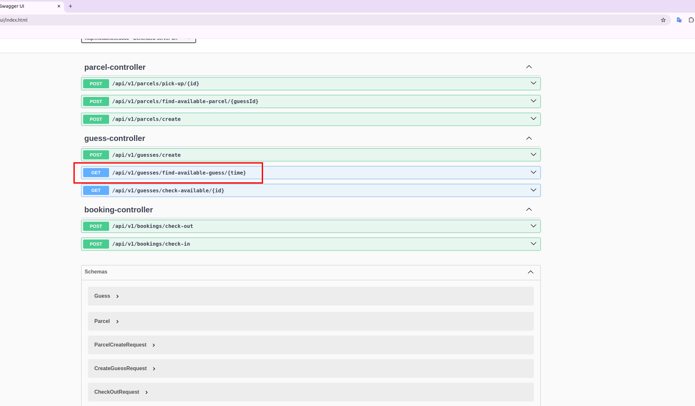
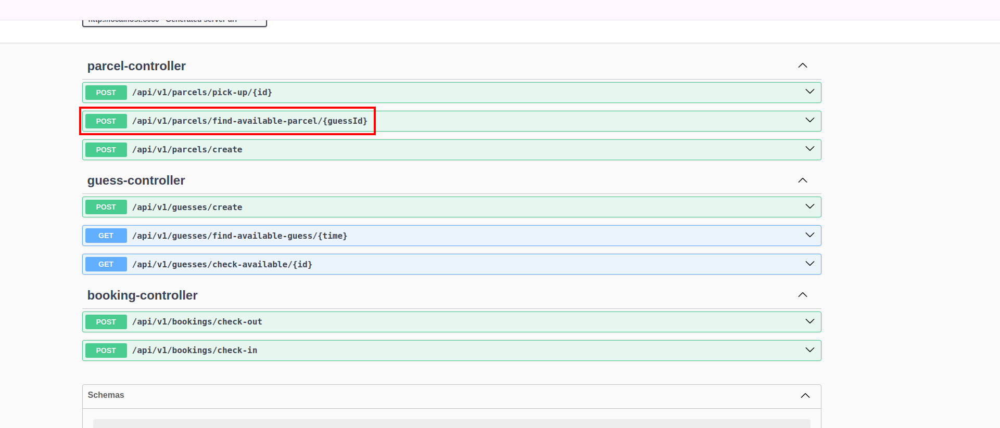

# 1. Start mysql in docker-compose.yml
# 2. Run app in docker-compose.yml or ide
# 3. access swagger at http://localhost:8080/swagger-ui/index.html
# 4 Run API to check following requirements
## 4.1 The receptionist needs a tracking tool that knows to any given time which guests are checked into the hotel and have not checked out, in order to allow the receptionist to make the decision of whether
to accept the parcel or not.

## 4.2. The tracking tool should further allow the receptionist to check for parcels available for pick-up when the guest is checking out.

